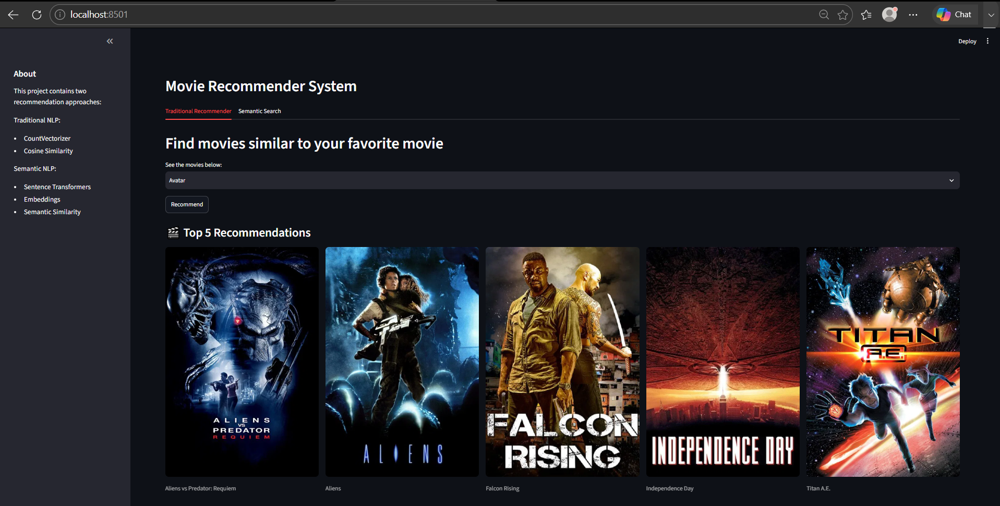
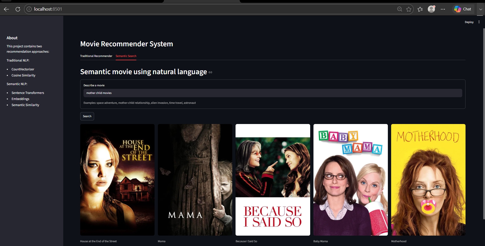
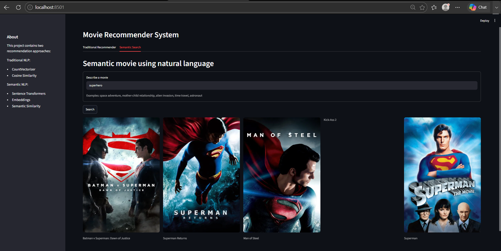

# Movie Recommender System

A hybrid **Movie Recommendation System** built using **Machine Learning, Natural Language Processing (NLP), and Sentence Transformers**. This application provides two recommendation approaches:

- **Traditional Content-Based Recommendation** using Cosine Similarity
- **Semantic Search** using Sentence Transformers, allowing users to search movies with natural language descriptions.

## Features

* Traditional Content-Based Movie Recommendation
* Semantic Movie Search using Sentence Transformers
* Movie Poster Fetching using TMDB API
* Streamlit Web Application
* Hybrid Recommendation Approach

# Project Highlights

- Built a content-based recommendation engine using **CountVectorizer** and **Cosine Similarity**.
- Extended the project by integrating **Semantic Search** using **Sentence Transformers**.
- Developed an interactive **Streamlit** application with two recommendation modes.
- Integrated the **TMDB API** to dynamically fetch movie posters.
- Organized the project into a modular and maintainable structure.

---

## Technologies Used

- Python
- Pandas
- NumPy
- Scikit-learn
- Sentence Transformers
- Streamlit
- Requests
- TMDB API

## Traditional Recommender

The traditional recommender uses content-based filtering and cosine similarity to recommend movies similar to a selected movie.

## Semantic Search

Users can describe a movie using natural language
Example Queries:

- astronaut
- space adventure
- alien invasion
- time travel
- superhero
- father daughter space mission
 and the system retrieves semantically similar movies using embeddings generated by Sentence Transformers.

## Dataset

* TMDB 5000 Movies Dataset
* TMDB 5000 Credits Dataset

# Application Preview
## Traditional Recommendation

## Semantic Search

## Natural Language Search Example

## How to Run

1. Clone the repository
2. Install dependencies

pip install -r requirements.txt

3. Run the application

streamlit run app.py

## Future Improvements

* User authentication
* Personalized recommendations
* Collaborative filtering
* Advanced UI enhancements
* Cloud deployment

# License

This project is licensed under the **MIT License**.

## Author

**Shreya Das Gupta**

This project was developed as part of my Machine Learning learning journey to explore recommendation systems, NLP, and semantic search.

If you found this project interesting, feel free to connect with me on LinkedIn or explore the repository.

⭐ If you like this project, consider giving it a star!